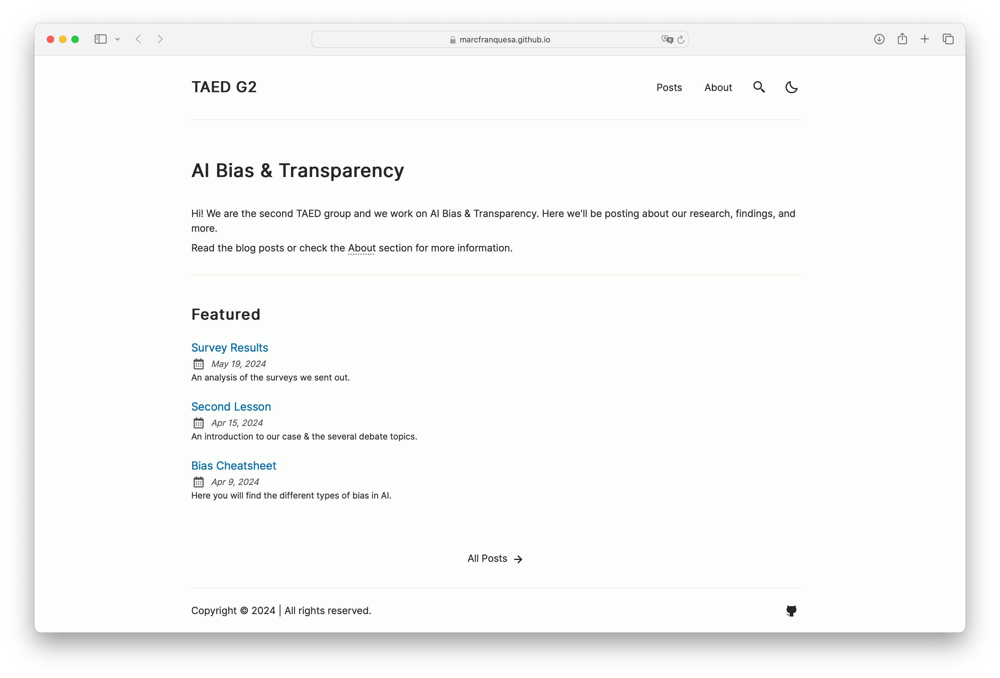

# AI Bias & Transparency Blog

This blog was created for the [Ethics](https://www.fib.upc.edu/en/studies/bachelors-degrees/bachelor-degree-data-science-and-engineering/curriculum/syllabus/TAED1-GCED) course in the Data Science degree program at UPC. As you might guess, it contains content related to bias and transparency in AI.

    

I took the opportunity to experiment with the [Astro](https://astro.build) framework. You can find my starting point [here](https://github.com/satnaing/astro-paper).
